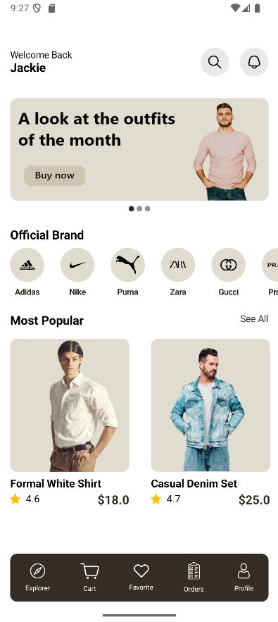
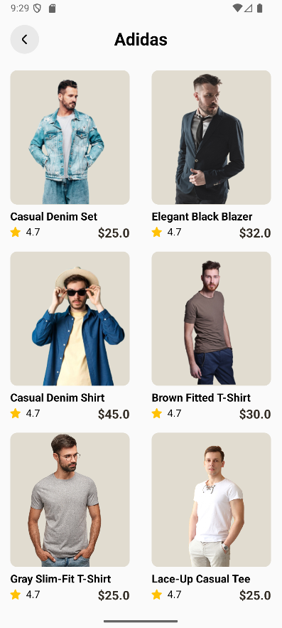
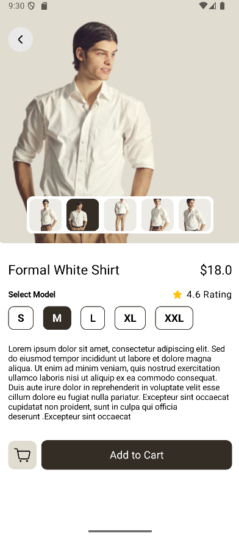
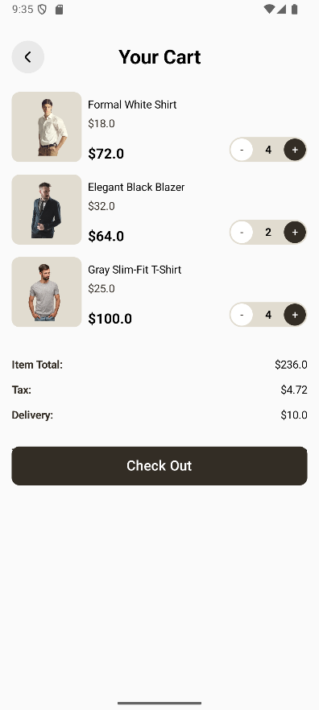

# OnlineShop Android App

A modern Android e-commerce application built with Jetpack Compose and Firebase.

## Screenshots

<!-- Add your app screenshots here -->
<table>
  <tr>
    <td></td>
    <td></td>
    <td></td>
    <td></td>
  </tr>
  <tr>
    <td align="center">Main Screen</td>
    <td align="center">Category Screen</td>
    <td align="center">Product Detail</td>
    <td align="center">Cart Screen</td>
  </tr>
</table>

## Features

- **Modern UI**: Built with Jetpack Compose for native Android experience
- **Product Browsing**: Browse products by categories with smooth navigation
- **Shopping Cart**: Add/remove items with quantity management
- **Product Details**: Detailed product information with image gallery
- **Firebase Integration**: Real-time data synchronization
- **Responsive Design**: Optimized for different screen sizes
- **Auto-sliding Banners**: Promotional content carousel
- **Search Functionality**: Find products quickly
- **User Profile**: Personal account management

## Technologies Used

### Core Technologies
- **Kotlin** - Primary programming language
- **Jetpack Compose** - Modern Android UI toolkit
- **Android SDK** - Target SDK 36, Min SDK 24

### Architecture & Libraries
- **MVVM Pattern** - Using ViewModel and LiveData
- **Firebase** - Backend services and real-time database
- **Coil** - Image loading library for Compose
- **Glide** - Additional image loading support
- **Gson** - JSON parsing
- **Material Design 3** - UI components and theming

### UI Libraries
- **Accompanist Pager** - Carousel and pager components
- **ConstraintLayout Compose** - Complex layouts
- **Material Components** - UI elements

### Development Tools
- **Gradle** with Kotlin DSL
- **Android Studio**
- **JUnit** - Unit testing
- **Espresso** - UI testing

## Prerequisites

- Android Studio Arctic Fox or later
- JDK 11 or higher
- Android SDK with API level 24+
- Firebase project setup
- Google Services configuration

## Installation

1. **Clone the repository**
   ```bash
   git clone https://github.com/yourusername/OnlineShop.git
   cd OnlineShop
   ```

2. **Open in Android Studio**
   - Launch Android Studio
   - Select "Open an Existing Project"
   - Navigate to the cloned directory

3. **Firebase Setup**
   - Create a new Firebase project at [Firebase Console](https://console.firebase.google.com/)
   - Add Android app to your Firebase project
   - Download `google-services.json` and place it in the `app/` directory
   - Enable Firebase Realtime Database in your Firebase console

4. **Build and Run**
   ```bash
   ./gradlew build
   ```
   - Connect your Android device or start an emulator
   - Click "Run" in Android Studio

## Project Structure

```
app/
├── src/main/
│   ├── java/com/example/onlineshop/
│   │   ├── Activity/          # Activity classes
│   │   │   ├── MainActivity.kt
│   │   │   ├── CartActivity.kt
│   │   │   ├── DetailActivity.kt
│   │   │   └── ...
│   │   ├── Model/             # Data models
│   │   │   ├── ItemsModel.kt
│   │   │   ├── CategoryModel.kt
│   │   │   └── SliderModel.kt
│   │   ├── ViewModel/         # ViewModels
│   │   │   └── MainViewModel.kt
│   │   ├── Repository/        # Data repositories
│   │   │   └── MainRepository.kt
│   │   └── Helper/            # Utility classes
│   │       ├── ManagmentCart.kt
│   │       └── TinyDB.java
│   ├── res/                   # Resources
│   │   ├── drawable/          # Images and icons
│   │   ├── layout/            # XML layouts
│   │   ├── values/            # Colors, strings, themes
│   │   └── mipmap/            # App icons
│   └── AndroidManifest.xml
├── build.gradle.kts
└── google-services.json
```

## App Flow

1. **Intro Screen** - Welcome screen with app branding
2. **Main Screen** - Product categories, banners, and popular items
3. **Category Listing** - Products filtered by selected category
4. **Product Detail** - Detailed product information and add to cart
5. **Shopping Cart** - Review selected items and manage quantities

## Configuration

### Firebase Database Structure
```json
{
  "Banner": [
    {
      "id": 1,
      "url": "banner_image_url"
    }
  ],
  "Category": [
    {
      "id": 1,
      "picUrl": "category_image_url",
      "title": "Category Name"
    }
  ],
  "Items": [
    {
      "categoryId": 1,
      "title": "Product Name",
      "price": 99.99,
      "picUrl": ["image1_url", "image2_url"],
      "description": "Product description",
      "rating": 4.5
    }
  ]
}
```

## Acknowledgments

- Firebase for backend services
- Material Design team for UI guidelines
- Jetpack Compose team for the modern UI toolkit
- Open source community for various libraries used

---

If you found this project helpful, please give it a star!